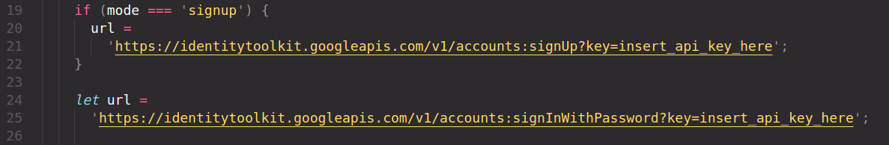

# Vue 3 App

This app permit you to choice a coach and send him a message with email and text.

You can register as user and then as coach.

If you are a coach you can receive some requests from others users and you can read in your private area requests.

To use App you need to create a Firebase Project with RealTimeDataBase, set authentication with email and password and insert your apikey in the file actions.js in /src/store/modules/auth here:

